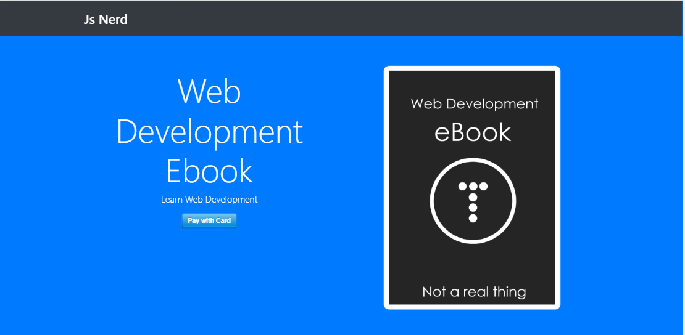

# StripeAPI-with-NodeJS
## Created a Web App to consume Stripe API .

## `Getting started`

To get the frontend running locally:
<ul>
  <li>Clone this repo</li>
  <li> run npm install to install all req'd dependencies </li>
  <li> run node app to start the local server.</li>
  <li> Now go to http://localhost:3000 for Preview</li>
</ul>
